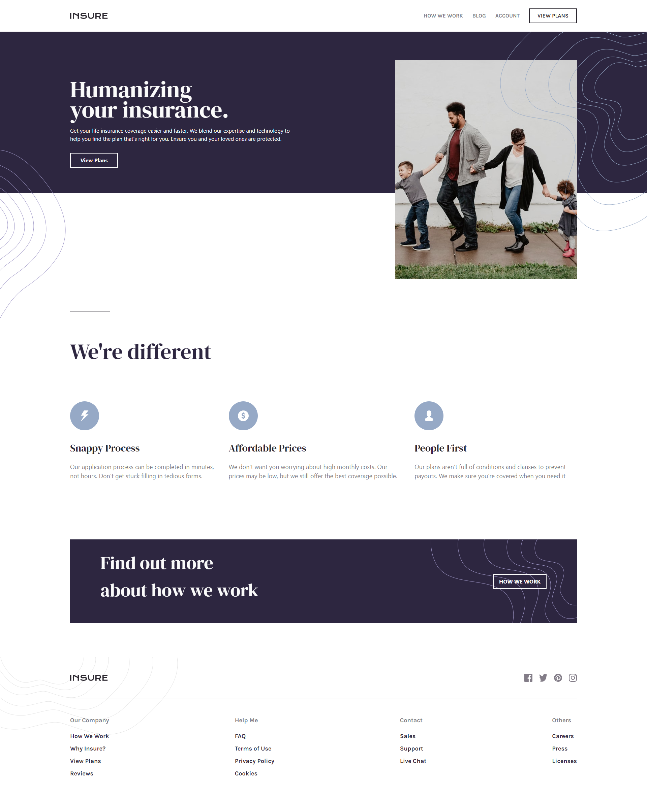
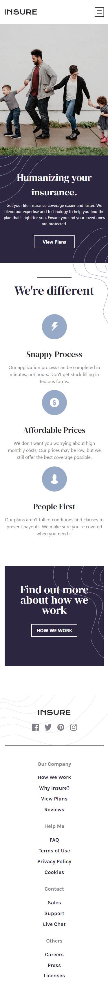

# Frontend Mentor - Insure landing page solution

This is a solution to the [Insure landing page challenge on Frontend Mentor](https://www.frontendmentor.io/challenges/insure-landing-page-uTU68JV8).

## Table of contents

- [Overview](#overview)
  - [Screenshot](#screenshot)
  - [Links](#links)
- [My process](#my-process)
  - [Built with](#built-with)
- [Author](#author)

## Overview

### Screenshot

### Links

- Solution URL: [Github](https://github.com/handa26/insure)
- Live Site URL: [Insure Landing Page](https://phenomenal-llama-bc1819.netlify.app/)

## My process

### Built with

- Vite React.JS
- Tailwind CSS
- [Vite](https://vitejs.dev/guide/) - Frontend Tooling
- [Tailwind CSS](https://tailwindcss.com/) - For styles

## Author

- Website - [Ananda Muhammad](https://handa260.netlify.app/)
<!-- - Frontend Mentor - [@yourusername](https://www.frontendmentor.io/profile/yourusername) -->
- Twitter/X - [@_handa26](https://twitter.com/_handa26)
